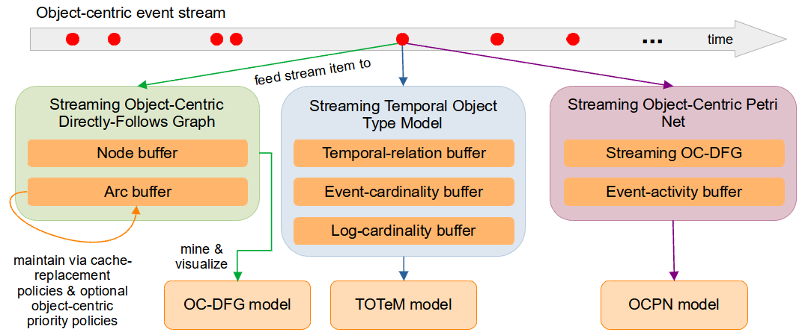

# Object-Centric Streaming Discovery

This streaming framework supports the online discovery of <i>Object-Centric Directly-Follows Graphs</i> (OC-DFGs) \[[1](#1)\], <i>Object-Centric Petri Nets</i> (OCPNs) \[[2](#2)\], and <i>Temporal Object Type Models</i> (TOTeM models) \[[3](#3)\] from object-centric event streams. Currently, object-centric event streams are simulated based on OCEL 2.0 logs in JSON format.



## Setup

The implementation is based on Python 3.12. For evaluation purposes, each model can be discovered offline on a full log and translated to the representation used by the streaming framework. The offline discovery of TOTeM requires version 1.3.3 of the `ocpa` library, which requires version 2.2.32 of `pm4py` \[[4](#4)\]. The offline discovery of OC-DFGs and OCPNs does not rely on `ocpa` and uses `pm4py` version 2.7.15.
Therefore, two different virtual environments need to be set up to evaluate each online model against its offline model.

```bash
# Set up venv for OC-DFG and OCPN discovery
python -m venv path/to/pm4py/venv
source path/to/pm4py/venv/Scripts/activate
pip install -r requirements_pm4py.txt
```
```bash
# Set up venv for TOTeM discovery
python -m venv path/to/ocpa/venv
source path/to/ocpa/venv/Scripts/activate
pip install -r requirements_ocpa.txt
```

## Usage

The `data` directory contains a small example OCEL 2.0 log in XML and JSON format. It also contains scripts for automatically downloading a large container-logistics \[[5](#5)\] and <i>Age of Empires</i> \[[6](#6)\] log and pre-processing the former. Classes and functions for converting a log into an event stream, processing the stream by updating a streaming representation, and mining, visualizing, and evaluating the resulting model are located in the `src` directory.

### Downloading OCEL 2.0 logs

The two afore-mentioned large logs can be downloaded automatically with the following commands. The additional pre-processing steps ensure the logs contain uniform timestamp formats, for example, and that the JSON files are indented properly.

```bash
source path/to/pm4py/venv/Scripts/activate
cd data
python download_logs.py
python fix_xml_ContainerLogistics.py
./format_jsons.sh
```

### Converting log to object-centric event stream

Example for loading OCEL 2.0 log as event stream:

```python
from utils import EventStream

event_stream = EventStream(path/to/json/ocel, o2o_has_time=False)
```

### Processing stream

Example workflow for creating event stream, defining parameters of streaming representation, and processing stream; works analogously for `OcdfgBufferPerObjectType`, `OcpnBuffer`, and `TotemBuffer`:

```python
from utils import EventStream
from model_buffers import OcdfgBuffer
from cache_policy_buffers import CachePolicy
from priority_policy_buffers import PPBLifespanPerObject, PrioPolicyOrder

# Create event stream
event_stream = EventStream(path/to/json/ocel, o2o_has_time=False)

# Set up streaming representations with model buffers e.g. of size 100 each and with mandatory cache policy and optional priority policy
ocdfg_buf = OcdfgBuffer(
    100, 
    100, 
    CachePolicy.LRU, 
    pp_buf=PPBLifespanPerObject(prio_order=PrioPolicyOrder.MAX), 
    coupled_removal=False
)

# Process entire stream; can enable/disable that additional O2O relations are derived from in-coming events
ocdfg_buf.process_stream(event_stream.stream, enrich_o2o=False)
```

### Discovering and visualizing model from streaming representation

Assume `ocdfg_buf` and `event_stream` as above. Models are mined and visualized analogously for OCPNs via `OcpnModel` and for TOTeM via `TotemModel`:

```python
[...]
from model_builder_ocdfg import OcdfgModel
import matplotlib as mpl
import matplotlib.cm as cm
import numpy as np

# Here, 10% of least frequent nodes and arcs are removed from resulting OC-DFG
ocdfg_model = OcdfgModel(ocdfg_buf, prune_node_frac=0.1, prune_arc_frac=0.1, verbose=False)

# Define color per object type for visualization
ots = sorted(event_stream.object_types)
ot_rgb_colors = cm.jet(np.linspace(0, 1, len(ots)))
ot_to_rgb_color = dict(zip(ots, ot_rgb_colors))
ot_to_hex_color = {ot: mpl.colors.rgb2hex(ot_rgb) for ot, ot_rgb in ot_to_rgb_color.items()}
ocdfg_model.visualize(path/to/output/directory, 'ocdfg.pdf', ot_to_hex_color, visualize_dfgs=True)
```

### Evaluation

The streaming framework offers three "angles" for evaluation:

#### A-priori evaluation
In the a-priori evaluation, object-centric characteristics related to priority policies are collected and visualized for the whole log/stream. The example code and the results for the small example, <i>Age of Empires</i>, and container-logistics log are given in the Juypter notebook `apriori_evaluation.ipynb`.

#### Online-vs-offline evaluation
The accuracy, precision, and recall of each online model can be quantified against its offline model. For OC-DFGs, the mean squared error of the node and arc annotations is additionally computed. For TOTeM, a distance metric with values between 0 and 1 additionally captures the distance in relations between the online and offline model. While this is not possible for OCPNs due to indistinguishable silent transitions, the corresponding online and offline models for TOTeM and OC-DFGs can be visualized in an "overlapped" way, including their annotations. Assume `ocdfg_model` and `ot_to_hex_color` as above, then example evaluation steps are:
```python
[...]
from model_builder_ocdfg import get_ocdfg_accuracy, visualize_ocdfg_overlap
from onl_vs_offl_evaluation_ocdfg_ocpn import plot_heatmap_cp_x_pp

# Create offline model on same log as online model
ocdfg_model_offl = OcdfgModel(path/to/json/ocel, prune_node_frac=0.1, prune_arc_frac=0.1)

# Obtain all fine-grained evaluation scores
score_dict = get_ocdfg_accuracy(offl_model, onl_model)
print(score_dict)

# Plot overlapped online and offline OC-DFGs
visualize_ocdfg_overlap(
    ocdfg_model_offl,
    ocdfg_model,
    path/to/output/directory,
    ocdfg_model.get_graphviz_overlap_file_name(ocdfg_model_offl.prune_node_frac, ocdfg_model_offl.prune_arc_frac),
    ot_to_hex_color
)

# Plot average scores for accuracy, precision, and recall for all combinations of cache and priority policy as heatmap
# Resulting PDF is saved to "scoring_output" folder at root level
plot_heatmap_cp_x_pp(path/to/json/ocel, 'ocdfg', buf_size=20)
```
Note that the offline TOTeM model requires an XML input log, since `ocpa` is used for importing OCELs, however, JSON logs work fine for offline OC-DFGs and OCPNs. The above steps can be implemented analogously for TOTeM via `model_builder_totem.py` and `onl_vs_offl_evaluation_totem.py`.

#### Runtime and cache-behavior evaluation
The runtime and cache behavior during stream processing can be recorded via optional `RuntimeMonitor` and `CacheMonitor` attributes in each streaming representation. The former takes runtime measurements, e.g. of individual buffer updates, while the latter e.g. records the distribution of object types across model buffers at 10% intervals in the stream. The collected data can be aggregated and visualized via functionality defined in `monitor_evaluation.py`, e.g.:
```python
from utils import EventStream
from model_buffers import TotemBuffer
from monitor import CacheMonitor, RuntimeMonitor
from cache_policy_buffers import CachePolicy
from priority_policy_buffers import PrioPolicyOrder, PPBEventsPerObjectType

# Process event stream while collecting cache-behavior data
event_stream = EventStream(path/to/json/ocel)
totem_buf = TotemBuffer(
    125, 
    125, 
    125, 
    CachePolicy.FIFO,
    pp_buf=PPBEventsPerObjectType(prio_order=PrioPolicyOrder.MIN), 
    coupled_removal=False, 
    cache_monitor=CacheMonitor()
)
totem_buf.process_stream(event_stream.stream)

# Process and visualize data collected by CacheMonitor
totem_buf.create_monitor_dataframes()
create_all_plots_cache_monitor(totem_buf.c_mon, path/to/output/directory)
```

## Authors

The streaming framework for discovering object-centric models was created by [Nina Löseke](https://github.com/loeseke). [Lukas Liss](https://github.com/LukasLiss) contributed the original code of the [Temporal Object Type Model (TOTeM) Miner](https://github.com/LukasLiss/TOTeM-temporal-object-type-model).

## References

\[<a id="1">1</a>\] Alessandro Berti and Wil M. P. van der Aalst. OC-PM: analyzing object-centric event logs and process models. <i>Int. J. Softw. Tools Technol. Transf.</i>, 25(1):1–17, 2023. doi: 10.1007/S10009-022-00668-W. URL https://doi.org/10.1007/s10009-022-00668-w.<br>
\[<a id="2">2</a>\] Wil M. P. van der Aalst and Alessandro Berti. Discovering Object-centric Petri Nets. <i>Fundam. Informaticae</i>, 175(1-4):1–40, 2020. doi: 10.3233/FI-2020-1946. URL https://doi.org/10.3233/FI-2020-1946.<br>
\[<a id="3">3</a>\] Lukas Liss, Jan Niklas Adams, and Wil M. P. van der Aalst. TOTeM: Temporal Object Type Model for Object-Centric Process Mining. In Andrea Marrella, Manuel Resinas, Mieke Jans, and Michael Rosemann, editors, <i>Business Process Management Forum</i>, pages 107–123, Cham, 2024. Springer Nature Switzerland. ISBN 978-3-031-70418-5.<br>
\[<a id="4">4</a>\] Alessandro Berti, Sebastiaan J. van Zelst, and Daniel Schuster. PM4Py: A process mining library for Python. <i>Softw. Impacts</i>, 17:100556, 2023. doi: 10.1016/J.SIMPA.2023.100556. URL https://doi.org/10.1016/j.simpa.2023.100556.<br>
\[<a id="5">5</a>\] Nina Graves and Benedikt Knopp. Container Logistics Object-centric Event Log, 2023. URL https://doi.org/10.5281/zenodo.8428084.<br>
\[<a id="6">6</a>\] Lukas Liss, Nico Elbert, Christoph M. Flath, and Wil M. P. van der Aalst. Object-Centric Event Log for Age of Empires Game Interactions (Version 1.1.0), June 2024. URL https://doi.org/10.5281/zenodo.11506366.